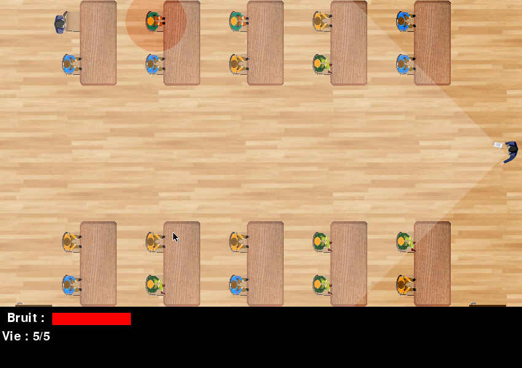

# Crazy Class

## Présentation

Le jeux "Crazy Class" a pour but de faire échapper un élève de sa salle de cours sans que le professeur ne s'en aperçoive.

Il se présente par la vue en 2D par le dessus de la salle de classe, les élèves restent assis pour écouter le cours et le professeur navigue du tableau aux élèves pour les aider.



# Contrôles

Vous contrôlez un élève assis aléatoirement, d'un clic gauche vous ciblez une destination, mais celle-ci ne prend pas en compte les potentiels obstacles sur votre passage. Par des déplacements successifs vous devez atteindre une des deux portes.

# Succès et échec

Pour gagner et passer au niveau suivant, il vous suffit d'atteindre une des deux portes placé au début et au fond de la salle. Mais il existe plusieurs motifs d'échecs, chacun d'eux vous feront perdre une vie parmi 5 au début du niveau, au bout de 5 vies consommées, le niveau recommence mais avec la même difficulté.


A chaque perte de vie vous retournez à votre place. Vous pouvez perdre une vie en touchant une table, chaise ou le professeur, mais aussi en étant vue par le professeur.

# Niveau

A chaque succès la difficulté augmente et se manifeste par l'augmentation de la vitesse du professeur et la réduction de la vôtre. Aussi la probabilité de vous placer proche du tableau augmente tout comme la probabilité du professeur de naviguer plus vers les élèves et moins vers le tableau.

# Execution

Le jeu se lance avec l'interpréteur python sur le fichier `main.py` :

```bash
python main.py
```

